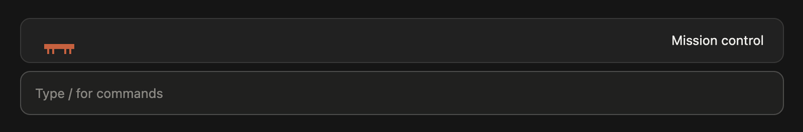
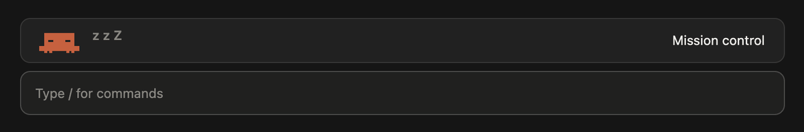
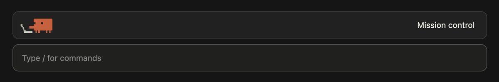
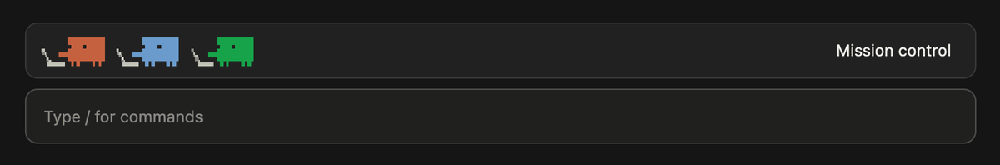
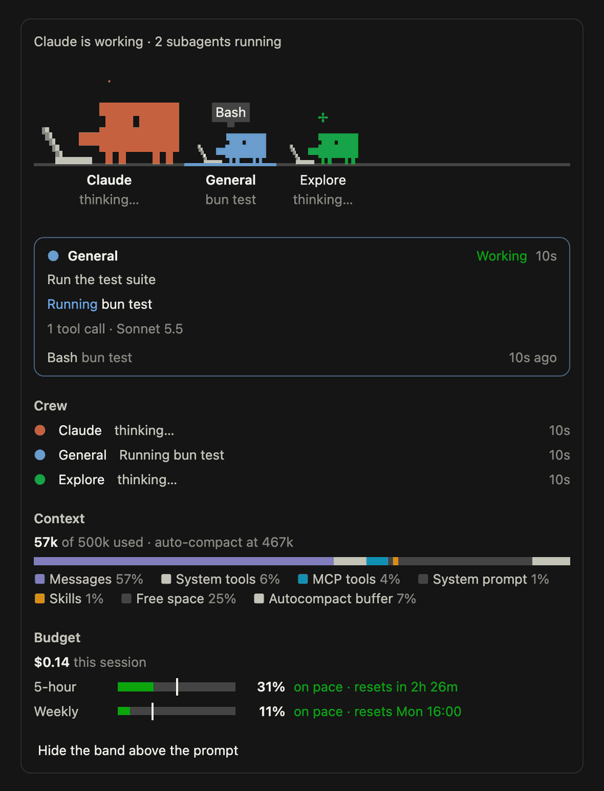

# Mission control

A [Claude Code](https://claude.com/claude-code) mod that puts your crew on screen. Claude and every subagent it starts get their own pixel Clawd, live in a band above the prompt. One click opens Mission control: every agent at a glance, the context and the budget.

It runs in the desktop app and the terminal. On the desktop the Clawds are pixel art; in a terminal they're block characters, like the logo.

## Idle: Claude has the band to itself

When Claude is waiting on you and has no subagents, it wanders up and down the band. It stops to look around, hop, dance, stretch, twirl, duck into the floor and pop back up, or doze off for a bit.



## Napping

After three minutes with nothing to do, it falls properly asleep and snores.



## At work

When a turn starts, Claude scuttles back to its desk and types at its laptop. Each subagent it starts rises into the band, walks to a laptop of its own and gets typing too. The screen lights up while a tool runs.



## Hover: who is doing what

Point at a Clawd and it turns from its laptop to look at you, waving hello. A pixel speech bubble beside it says who it is, what it's doing and what it was asked. Move away and it goes back to work. Click a Clawd to open Mission control on it.


## Done

A subagent that finishes cheers and hops, then sinks out of sight. One that fails droops and greys out first.



## Mission control

Click **Mission control** in the band, click a Clawd, or type `/mission`. The pane shows:

- the whole crew on stage
- a card for the newest agent at work, or whoever you pick: their task, what they're doing now and their latest tool calls
- the context: how much is used, what fills it and when it will auto-compact
- the budget: what this session has spent, and your 5-hour and weekly limits, with a pace check against each



## Install

You need a Claude Code build that supports mods: a `plugin.json` plus a `hooks/register.tsx` module. It was built and tested on 2.1.289 and 2.1.292.

Clone it into your skills folder, and every new session loads it:

```bash
git clone https://github.com/datvodinh/claude-mission-control ~/.claude/skills/mission-control
```

To load it into a session that's already open, type `/reload-plugins`. To switch it off, delete the folder.

To try it for a single terminal session without installing:

```bash
claude --plugin-dir /path/to/claude-mission-control
```

## Develop

| File | What it does |
| --- | --- |
| `hooks/register.tsx` | Follows the session's events (turns, tool calls, subagents, usage), keeps the crew's state, and draws the band and the pane |
| `hooks/clawd.tsx` | The animated Clawds: sprites, moods, the idle wandering and the hover bubble, drawn on its own frame clock |
| `hooks/view.tsx` | The band's and the pane's layout |
| `hooks/budget.ts` | Spend, and pace checks against the rate-limit windows |
| `hooks/tools.ts`, `hooks/format.ts` | How tool calls and numbers read |
| `tests/mission-control.test.tsx` | The behaviour, tested on both surfaces |

```bash
claude plugin validate .
claude plugin test .
```

## License

[MIT](LICENSE)
